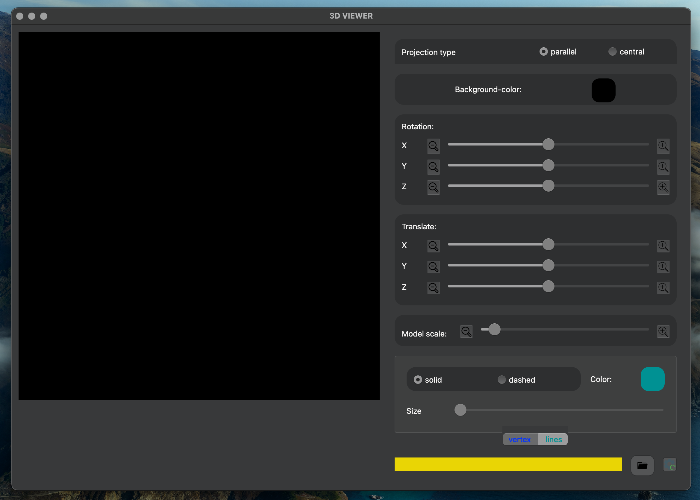
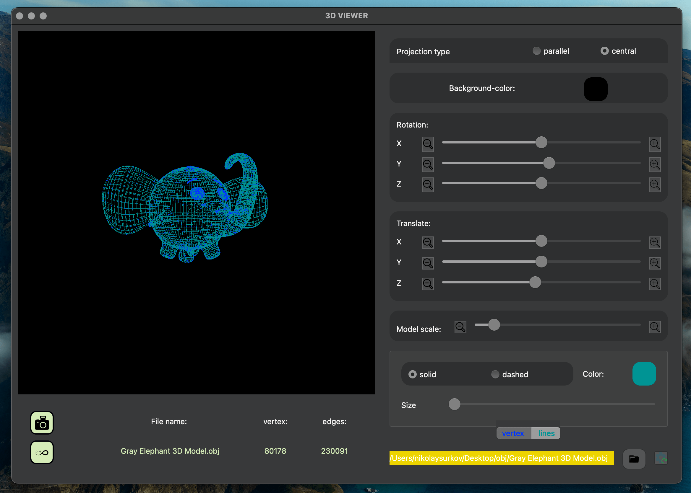

#  Проект  3DViewer\_v1.0_

## Введение

Основная часть проекта(model) написана на языке С(си), + визуальная составляющая(view) Qt6(C++) 
Информация находящаяся в этом файле поможет:

* 	 	собрать проект 
* 		провести UNIT-тестирование проекта

## Требования к системе
* установленная библиотека Qt
* установленная библиотека OpenGl
* doxigen
* Qmake или Qmake6
* check.h для тестирования

## Собираем проект
1. Заходим в директорию src/
	
2. Makefile: 
	* **all:** установка hamletViewer + unit-testing(clean + install + test)
	* **hamletViewer.a:** собирает библиотеку hamletViewer.a
	* **test:**  собирает тесты(си) из check файлов(директория /src/tests/*.check) -> test.c -> test и запускает тестирование ./test
	* **install:**  установка hamletViewer в ../build_hamlet_3dviewer/ if error (qmake)->(qmake6)
	* **uninstall:** удаление /build_hamlet_3dviewer/ и её содержимого
	* **dist:** создает архив `Archive_hamlet_3D_viewer.tgz` из содержимого которого можно собрать проект */../файлы необходимые для сборки исполняемого файла* `hamletViewer`
	* **dist_clean:** удалает `Archive_hamlet_3D_viewer.tgz`
	* **dvi:** открывает этот файл, создает  документацию через doxygen и открывает ее в браузере
	* **gcov_report:** запускает тестирование и создает html отчет о покрытии кода
	* **open:** открывает отчет о покрытии кода, созданный целью *gcov_report*
	* **clang:** проверка Си файлов на стиль 
	* **leak:**	запуск тестов с valgrind or leaks
	* **clean:** удаление объектных, исполняемых файлов, файлов отчета .o .a .info .lox .tex
	* **rename_file:** Добавить расширение .obj
	* **rename_obj:** Удалить расширение .obj
	* **clean_all:** clean + uninstall + dist_clean

### Документация
* make dvi -->
* [documentation doxigen](doxygen/html/three__d__viewer_8h.html)

		

		

